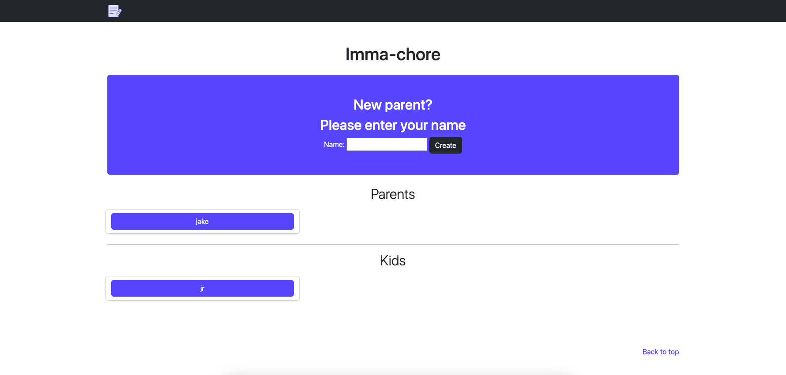
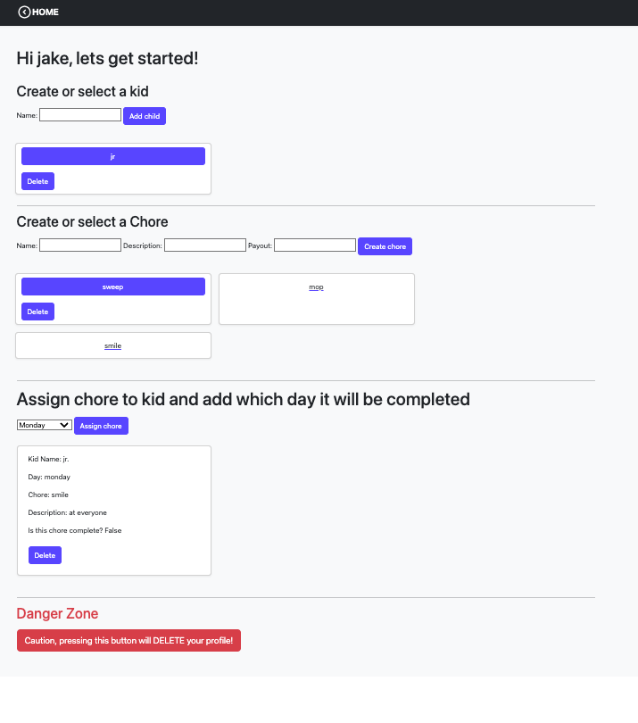
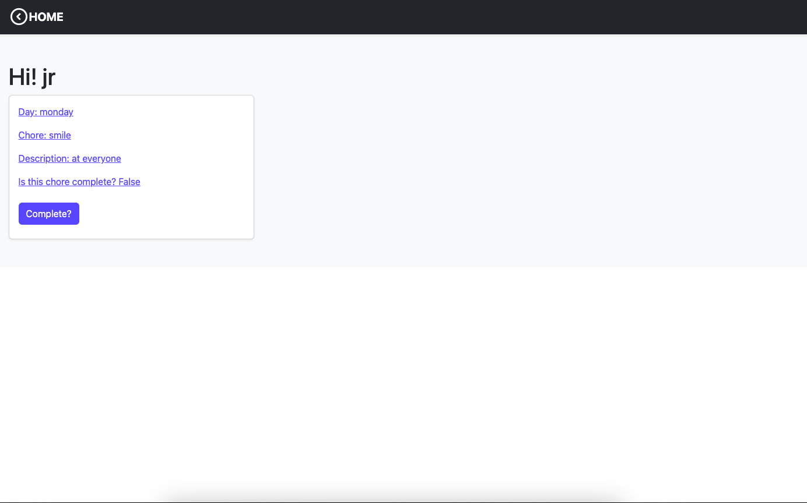

# Imm-a-chore

## A project that is a combined effort of three like-minded individuals

## Devs:
Name:            Github Username:

Amanda Testerman: amandaTesterman
Sean O'Brien: sobrien-banyan
Christopher Cialone: christopher-cialone

## Installation and run:
1. Clone the repo to your computer
2. run `python3 venv venv`
3. run `source venv/bin/activate` 
4. run `pip install -r requirements.txt`
5. run `python manage.py makemigrations`
6. run `python manage.py migrate`
7. run `python manage.py runserver`
8. And go to `http://localhost:8000` or `http://127.0.0.1:8000/` in your favorite browser

## How to use app:

### Parent:
Create a Parent profile by enter your name. If a profile has already been created select your profile under the header 'Parent'.
On the Parent page the first thing to do is create kid profiles by entering their names. Second thing is to create chore by entering name, description and payout. To assign a chore select the kid, select the chore and the last step is to select the day of the week the chore will be done. Presto its done. Parent can delete kid profile by clicking the delete button on the kid card. Chore may only be deleted if the chore is not currently assigned and by clicking on the delete button on the chore card. To delete the parent profile scoll to the bottom of the parent page and select the big red button under the Danger Zone header.

### Kid:
The kid profile will need to be create by the parent. Kids can select their profile on the home page. View their chores on the kid page. Once the chore is complete the kid selects the complete button on the kid_chore card and the chore pay out will be added to their allowance earned.

### Home Page

### Parent

### Kid page

### The app has the following views:
* HomeView: displays a list of all parents and children and allows the user to create a new parent or select an existing parent to view their children and assigned chores.
* ParentView: allows the user to add new children to the parent, create new tasks and assign them to children, and view the progress of each child's assigned tasks.

### The app has the following models:
* Parent: stores information about the parent such as name and email.
* Kid: stores information about each child such as name and allowance earned.
* Chore: stores information about each task such as name and reward.
* Kid_Chore: stores information about the assignment of a task to a child such as the date the task was assigned and the date it was completed.

### The app has the follwoing forms:
* ParentForm: allows the user to create a new parent.
* KidForm: allows the user to add a new child to a parent.
* ChoreForm: allows the user to create a new task
* Kid_ChoreForm: allows the user to assign a task to a child.

